 

> **Mobile App Developer** · Bengaluru, India · MCA 
> Open to Work · Building in Public

I build fast, responsive cross-platform applications and developer tools. 
Deep into **Flutter**, **Dart**, **Python**, **JavaScript**, **Node.js**, and **FastAPI**.

<samp>dart &nbsp; flutter &nbsp; python &nbsp; javascript &nbsp; node.js &nbsp; fastapi &nbsp; firebase &nbsp; sqlite &nbsp; android-studio &nbsp; vs-code &nbsp; figma &nbsp; git &nbsp; vercel</samp>

