 

> **Mobile App Developer** · Bengaluru, India · MCA 
> Open to Work · Building in Public

I build fast, responsive cross-platform applications and developer tools. 
Deep into **Flutter**, **Dart**, **Python**, **JavaScript**, **Node.js**, and **FastAPI**.

<samp>dart &nbsp; flutter &nbsp; python &nbsp; javascript &nbsp; node.js &nbsp; fastapi &nbsp; firebase &nbsp; sqlite &nbsp; android-studio &nbsp; vs-code &nbsp; figma &nbsp; git &nbsp; vercel</samp>

**[8sujan6 Profile System](https://github.com/8sujan6/8sujan6)** &nbsp;·&nbsp; <samp>python, svg, smil</samp> 
Self-generating dynamic GitHub profile with automated stats graphics and custom ASCII portrait.

Every graphic here is generated directly for `@8sujan6`, not embedded from anyone else's server. 
`ascii.svg` is rendered from a custom photo pushed through a character ramp by 
[`scripts/make_portrait.py`](scripts/make_portrait.py); the stat graphics and 
these section headings are drawn from the GitHub API, committing only what changed.

